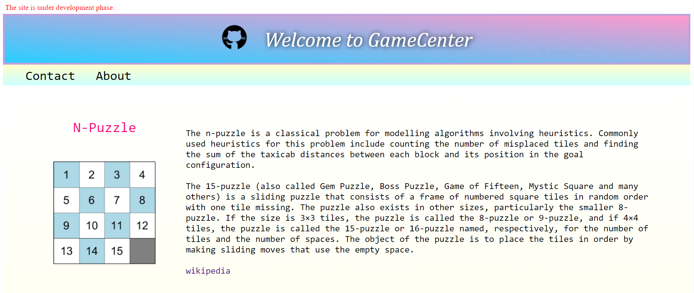
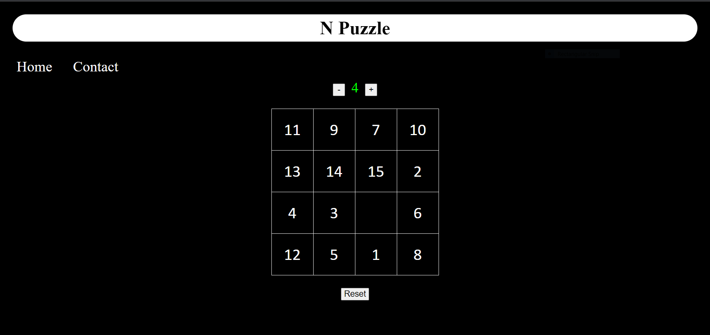
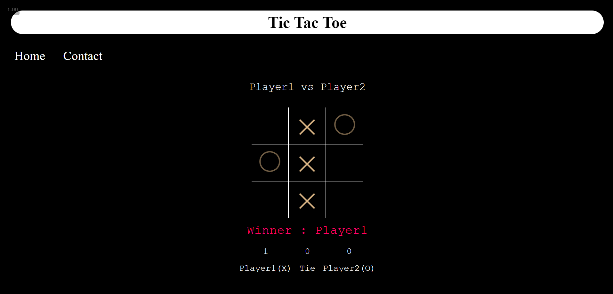

# GameCenter
- simple site to play simple games.
- games supported : `Tictactoe`, `N-Puzzle`
- Technology : `html`, `css`, `javascript`, `typescript`, `angular`

### How to run ?
- Install [node js](https://nodejs.org/en/download/) and [Angular cli](https://cli.angular.io/)
- download this repository.
- open cmd prompt `cd game-center`
- `npm install`
- `ng serve --open`

### Screenshots

**Home**

**N-Puzzle**

**Tic-Tac-Toe**

